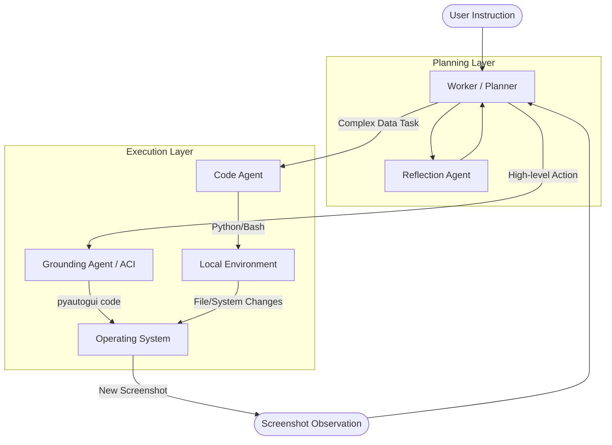

# Agent-S Architecture Overview

Agent-S is an open-source framework for autonomous computer interaction. The architecture is designed to be modular, separating high-level planning from low-level UI grounding and specialized code execution.

## Core System Workflow

---

## File-Based Architecture Mapping

The following table maps the core architectural components to their respective files in the `gui_agents/s3` directory.

| Component | Responsibility | Primary File(s) |
| :--- | :--- | :--- |
| **Orchestrator** | Top-level agent interface; manages the lifecycle of a task and coordinates between the Worker and Grounding layers. | `agents/agent_s.py` |
| **Planner (Worker)** | The "brain" of the agent. Analyzes screenshots, maintains trajectory history, and generates high-level plans using Multi-modal LLMs. | `agents/worker.py` |
| **Grounding (ACI)** | Translates high-level actions (e.g., "click the search bar") into executable OS-level code (pyautogui). | `agents/grounding.py` |
| **Code Agent** | A specialized iterative sub-agent that writes and executes code to solve complex data-processing or system tasks. | `agents/code_agent.py` |
| **Memory** | Manages procedural memory (system prompts), text buffers, and trajectory history. | `memory/procedural_memory.py` |
| **LLM Abstraction** | Unified interface for interacting with various LLM providers (OpenAI, Anthropic, Gemini, etc.). | `core/mllm.py`, `core/engine.py` |
| **Local Controller** | Safely executes Python and Bash scripts generated by the Code Agent on the host machine. | `utils/local_env.py` |
| **UI Interaction Utilities** | Helper functions for screen parsing, code formatting, and interaction logic. | `utils/common_utils.py`, `utils/formatters.py` |

---

## Key Component Details

### 1. Worker (`worker.py`)
The `Worker` class is responsible for the "Thinking" phase.
- **Inputs**: Current Instruction, Current Screenshot, Past Trajectory (History), and Reflections.
- **Process**: Consults `PROCEDURAL_MEMORY` to decide whether to use a GUI action or the `CodeAgent`.
- **Output**: A "Plan" and a high-level action description.

### 2. Grounding Agent / ACI (`grounding.py`)
The `OSWorldACI` class handles the "Grounding" phase.
- **Vision Grounding**: Uses models like UI-TARS to find $(x, y)$ coordinates from text descriptions.
- **OCR Grounding**: Uses Tesseract to locate text spans on the screen.
- **Execution**: Generates `pyautogui` code snippets for clicks, typing, dragging, scrolling, etc.

### 3. Code Agent (`code_agent.py`)
Triggered when the task requires programmatic manipulation (e.g., "calculate the sum of values in column B of a spreadsheet").
- **Iterative Loop**: Generates code $\rightarrow$ Executes $\rightarrow$ Observes Output $\rightarrow$ Corrects until `DONE`.
- **Sandbox**: Communicates with `LocalController` to run scripts.

### 4. Memory System (`procedural_memory.py`)
Contains the "DNA" of the agent in the form of highly detailed system prompts.
- Defines available tools and API signatures.
- Contains guidelines for "Case-based" reflection and evaluation.
- Manages the logic for "Safe to Auto-Run" versus "Requires Review" prompts.

---

## Action Pipeline

1. **Observe**: Capture a screenshot of the current UI state.
2. **Plan**: `Worker` analyzes the screenshot + instruction and generates a natural language plan.
3. **Reflect**: `ReflectionAgent` checks if the plan is progressing or stuck in a loop.
4. **Ground**: `GroundingAgent` translates the plan into a specific Python/PyAutoGUI command.
5. **Execute**: The generated code is executed on the OS, changing the state for the next iteration.
