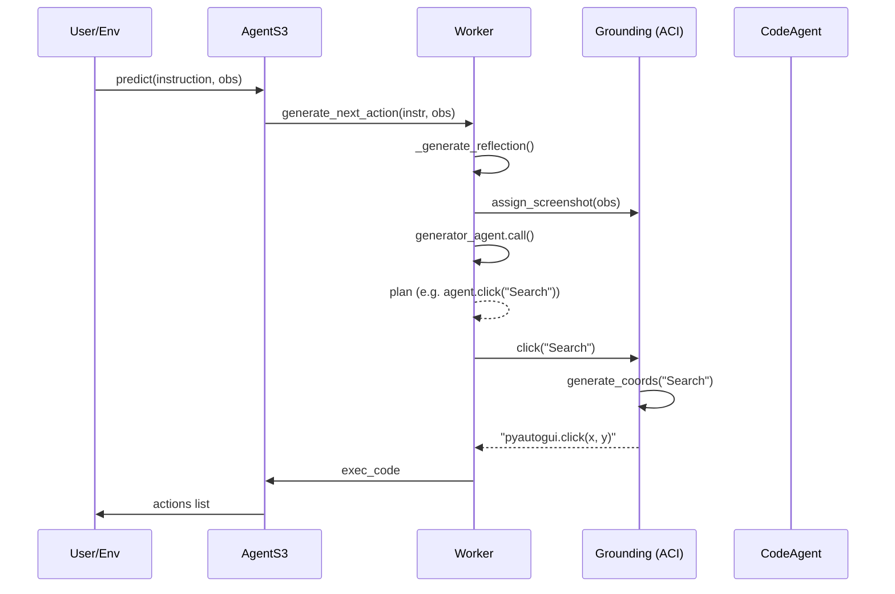

# Agent-S Code Logic Deep Dive

This document explains the internal logic and execution flow of the Agent-S framework, tracking a task from initial instruction to physical mouse/keyboard actions.

## 1. The High-Level Loop (`AgentS3`)

The framework operates in a continuous "Sense-Plan-Act" loop:
1. **Sense**: Receives `obs` (screenshot) and `instruction`.
2. **Plan**: `AgentS3` hands these to the `Worker`.
3. **Act**: The `Worker` returns a list of executable Python strings (PyAutoGUI).

## 2. Planning Logic (`Worker.py`)

The `Worker` is the strategist. Its logic is governed by:
- **Trajectory Management**: It keeps a running history of actions.
- **Reflection**: Before every action, it asks a secondary LLM, "Is the agent stuck? Is progress being made?". This reflection is injected into the primary prompt.
- **Context Handling**: It intelligently "flushes" old images while keeping text history, ensuring context limits aren't hit during long tasks.

## 3. Grounding Pipeline (`Grounding.py`)

This is where "natural language" meets "pixels."

### A. Visual Grounding
For actions like `click("The red login button")`:
1. The description is sent to a **Grounding Model** (Visual-Language Model).
2. The model returns normalized coordinates (e.g., `[500, 500]` on a 1000x1000 grid).
3. `resize_coordinates()` scales these to your actual screen resolution (e.g., 1920x1080).

### B. Text Grounding
For actions like `highlight_text_span("Hello", "World")`:
1. `pytesseract` (OCR) scans the screenshot to build a "Text Table" of every word and its bounding box.
2. An LLM analyzes this table and the "Phrase" to pick the correct `Word ID`.
3. The coordinates are extracted from the OCR data of that ID.

## 4. Code Agent Execution Logic (`code_agent.py`)

When the task is too complex for GUI clicks (e.g., "Calculate 500 spreadsheet rows"), the Worker calls the `CodeAgent`.

**Logic Flow:**
1. **Standalone Environment**: The agent starts a Bash or Python session.
2. **Iterative Steps**: It runs one snippet at a time (e.g., Step 1: List files, Step 2: Read CSV, Step 3: Compute sum).
3. **Internal Verification**: The prompt forces the agent to print results (e.g., `cat output.csv`) to verify its own work.
4. **Summary**: Once finished, it generates a human-readable summary. This summary is fed back to the `Worker`, who then "sees" the result through the CodeAgent's eyes.

## 5. Execution Logic (PyAutoGUI)

Finally, every action is converted into a Python string.
- `click` -> `import pyautogui; pyautogui.click(x, y)`
- `type` -> `pyautogui.write("text")` or `pyperclip.copy()` for Unicode.
- `switch_applications` -> `pyautogui.hotkey('command', 'space')` on macOS.

These strings are returned to the caller script (like `run_test.py`), which executes them using `exec()`.
