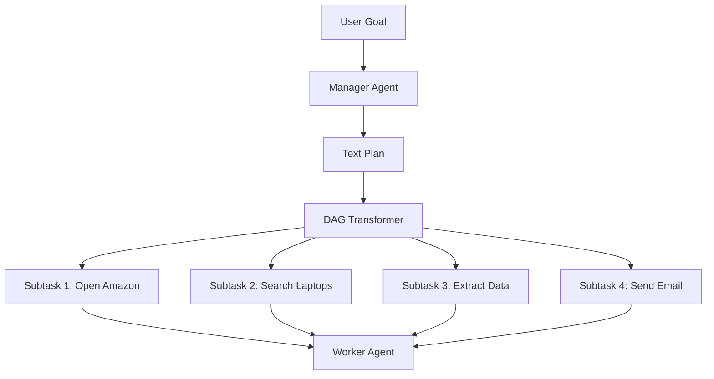

# Hierarchical Planning: Manager-Worker Decomposition

Agent-S (in its hierarchical configurations like S1/S2) utilizes a **Manager-Worker architecture** to solve complex tasks that require long-term planning and numerous UI interactions.

## 1. How Decomposition Works

The system breaks down a user's high-level request into executable pieces through a multi-step pipeline:

1.  **High-Level Planning**: The **Manager** receives the user's goal (e.g., "Find the 3 cheapest laptops on Amazon and email the list"). It generates a natural language step-by-step plan.
2.  **DAG Translation**: A specialized agent converts this plan into a **Directed Acyclic Graph (DAG)**. Each node in the DAG is a specific "Subtask."
3.  **Topological Sorting**: The Manager sorts these subtasks into a logical queue, ensuring that dependencies are met (e.g., you can't "email the list" before you "find the laptops").
4.  **Delegation**: The Manager sends one subtask at a time to the **Worker**. The Worker handles the raw GUI actions (clicks, drags, keyboard input) until that specific subtask is internally marked as `DONE`.

---

## 2. Why Two-Level Hierarchy is Optimal

### A. Solving the "Horizon" Problem
LLMs often struggle with long-horizon tasks where a single mistake in Turn 2 can derail a 50-turn execution. By breaking the task into subtasks, the **Worker's horizon is shortened**. It only needs to focus on "Opening the browser," making it much less likely to hallucinate or get stuck.

### B. Dynamic Re-planning
If the **Worker** fails a subtask (e.g., "Amazon is showing a CAPTCHA"), the **Manager** can re-evaluate the entire DAG. It might decide to "Wait 5 seconds" or "Try a different browser," rather than the Worker just clicking the CAPTCHA repeatedly.

### C. Context Hygiene
Screenshots and action histories consume massive amounts of "token space." By completing a subtask and returning control to the Manager, the system can "flush" the low-level GUI history (clicks/coords) and only keep the high-level result (e.g., "Successfully logged in"). This keeps the context clean for the next subtask.

### D. Separation of Concerns
- **Manager**: Expertise in **Reasoning & Strategy**. It doesn't need to know *where* pixels are.
- **Worker**: Expertise in **Perception & Grounding**. It doesn't need to know *why* we are searching for laptops; it just needs to know *how* to type in a search bar.

---

## 3. The Agent-to-Agent Control Loop

The code implementation in `gui_agents/s1/core/Manager.py` follows this execution flow:

1.  **Queue Generation**: The `get_action_queue()` function (Line 258) takes the high-level goal and generates a sorted list of subtasks.
2.  **The Delegation Loop**: 
    - The environment calls the Manager's `predict()` method.
    - The Manager identifies the current "Active Node" in the sorted queue.
    - It hands the **Subtask Description** of that node to the Worker.
3.  **Worker Autonomy**: The Worker enters its own internal loop. It takes screenshots and sends `pyautogui` actions to the OS, all while focusing *only* on its assigned subtask.
4.  **Completion Signal**: When the Worker believes its specific subtask is done (e.g., "Login screen closed"), it returns a `DONE` signal to the Manager.
5.  **Next Step**: The Manager marks that Node as complete and proceeds to the next Node in the topological order.

## 4. Why this is Robust
This design prevents **Goal Drift**. In non-hierarchical systems, an agent might start a task but get "distracted" by a pop-up and start trying to close the pop-up, forgetting its original goal. In this system, the Manager acts as a "Guardian of the Goal," ensuring that if the Worker gets lost, the Manager can reset it to the correct Subtask.
